# game-design（TRAE Skill）

这是个游戏精灵生成技能。

## 一键安装

| 方式 | 命令 / 操作 |
|------|------------|
| **项目级** | `cp -r game-design <项目根>/.trae/skills/`，重启或刷新 TRAE Agent。 |
| **全局级** | 国内版 `cp -r game-design ~/.trae-cn/skills/`；国际版 `cp -r game-design ~/.trae/skills/`。重启 TRAE 后自动索引。 |
| **设置面板上传** | `python scripts/pack_skill.py` 打包出 `game-design.zip`，然后在 TRAE「设置 → 规则与技能 → 创建技能 → 上传」选择该 zip 即可。 |

## 一次性配置

技能通过 **Seedream 4.5（火山引擎 Volcano Engine）** 的豆包图像端点驱动图像生成。

```bash
export DOUBAO_API_KEY="your-doubao-api-key"
export DOUBAO_API_URL="https://ark.cn-beijing.volces.com"

# 可选：不用真实 API key 跑通整条流水线
export SEEDREAM_MOCK_EN=true

pip install -r requirements.txt
```

## 文件地图

| 路径 | 用途 |
|------|------|
| `SKILL.md` | TRAE Skill 入口，Agent 第一时间读取。 |
| `REFERENCE.md` | 详尽规范：图集尺寸、API、prompt 工程、错误码。 |
| `EXAMPLES.md` | 四个端到端示例。 |
| `demo/` | 真实生成案例、流程截图、contact sheet、GIF 与录屏。 |
| `prompts/` | 风格、base、9 行动作的 prompt 模板。 |
| `references/animation-rows.md` | 9 行动作矩阵。 |
| `references/style-reference.md` | 视觉规范与 QA checklist。 |
| `references/layout-guides/` | 每行的布局引导图，调用 Seedream 时附加为参考。 |
| `scripts/seedream_client.py` | Seedream 4.5 / 豆包 API 适配器。 |
| `scripts/prepare_run.py` | 初始化 run 目录。 |
| `scripts/generate_base.py` | 生成 canonical-base.png。 |
| `scripts/generate_row.py` | 生成单行或所有动作行。 |
| `scripts/derive_running_left.py` | 镜像 running-right → running-left。 |
| `scripts/extract_frames.py` | 把 decoded 输出切成 192x208 的帧。 |
| `scripts/chroma_key.py` | 把 chroma key 背景替换为透明。 |
| `scripts/compose_atlas.py` | 拼出 1536x1872 spritesheet。 |
| `scripts/package_pet.py` | 输出 pet.json + spritesheet.webp 包。 |
| `scripts/render_qa.py` | 出 contact sheet 与 GIF 预览。 |
| `scripts/pack_skill.py` | 把整个 skill 文件夹打包为 zip。 |
| `scripts/build_layout_guides.py` | 重新生成 references/layout-guides/。 |


实际验收时，建议先看 `contact-sheet.png` 做全局检查，再用这 4 个 GIF 确认关键动作的节奏、表情和 silhouette 是否稳定。

## 端到端 smoke test（不需要 API key）

```bash
export SEEDREAM_MOCK_EN=true
python scripts/prepare_run.py --pet-name Smoke --description "test pet" --style codex-pixel --category Animals --output-dir ./run/smoke
python scripts/generate_base.py --run-dir ./run/smoke
python scripts/generate_row.py  --run-dir ./run/smoke --row all
python scripts/extract_frames.py --run-dir ./run/smoke
python scripts/chroma_key.py     --run-dir ./run/smoke
python scripts/compose_atlas.py  --run-dir ./run/smoke
python scripts/package_pet.py    --run-dir ./run/smoke --slug smoke--mock
python scripts/render_qa.py      --run-dir ./run/smoke
```

`run/smoke/final/` 会得到从合成占位图构建的 `pet.json` 和 `spritesheet.webp`。

## 真实跑

把 `SEEDREAM_MOCK_EN` 取消导出，然后正确导出 `DOUBAO_API_KEY` 和 `DOUBAO_API_URL`，命令完全相同。


### 依赖技能

- [doubao-api](https://github.com/jadragfly/doubao-api) - 豆包 API 调用

---

## 生成结果预览（img/）


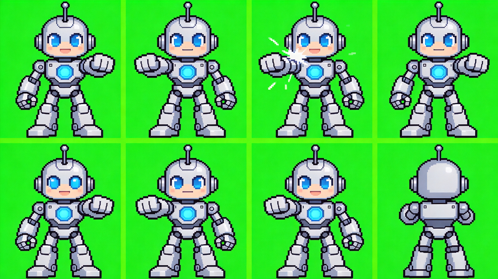
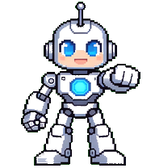

| 动作 GIF | 预览 |
|----------|------|
| idle | 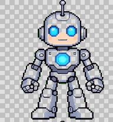 |
| attack | 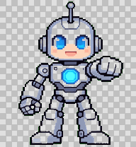 |
| crouch | 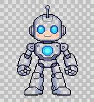 |
| jump | 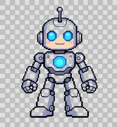 |
| pickup | 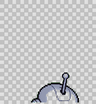 |
| walk-left | 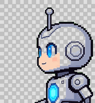 |
| walk-right | 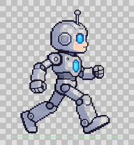 |

完整spritesheet：
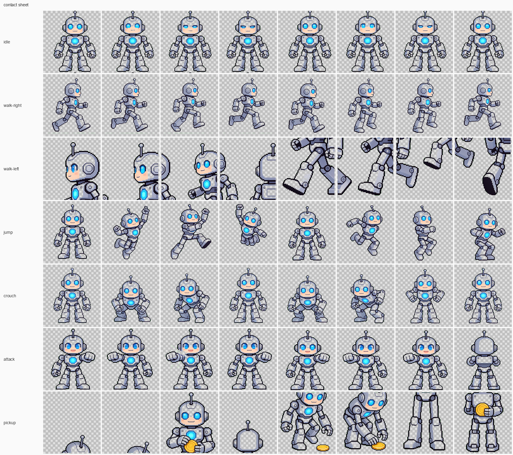
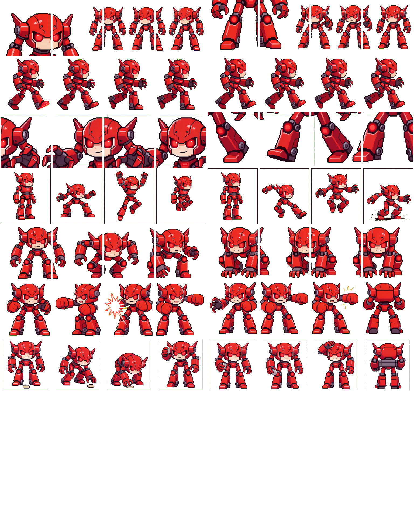

有时还需要生成物品

已知问题，如图：
idle gif图有点左右移动，这个还算矫正过了，基本能用，我不知道怎么约束它位置统一了。 
向左走的gif图，明显角色做大了，没完全在框内，目前也还没想好怎么约束，还在按抽卡方式解决，感觉不好，叫ai再生成一次，直到大体满意。总体来说，运气好的话，就一两个动作不太顺眼。

### 参考项目和感谢

宠物设计：
https://github.com/susirial/solo_com_pet_design

